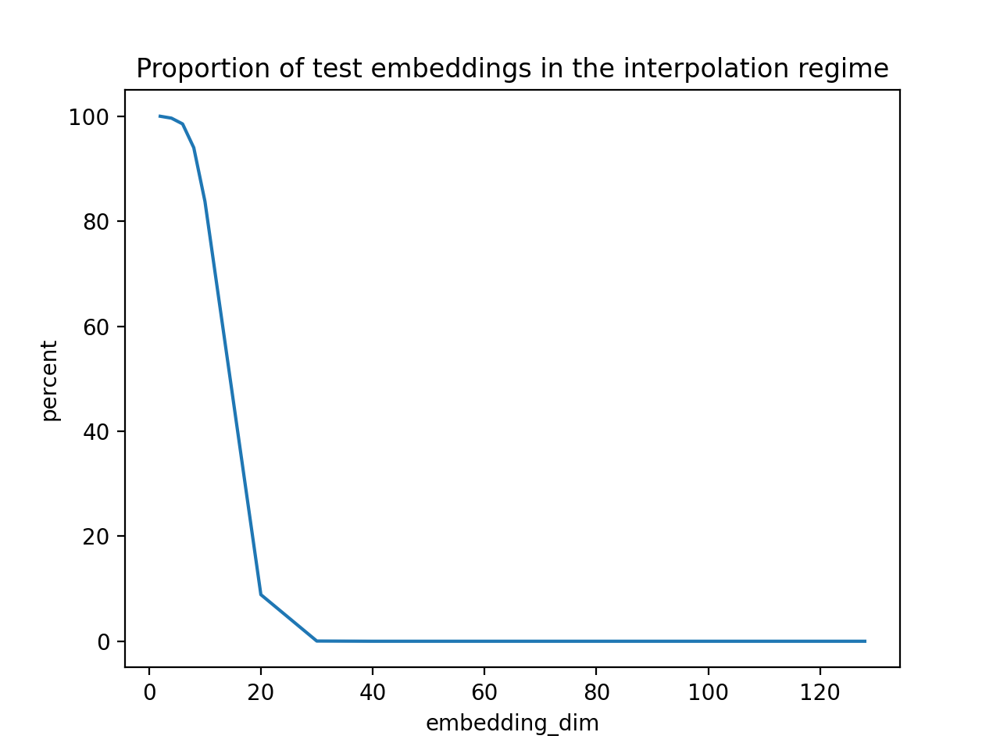

In this repo we reproduce and extend results of [Learning in High Dimension Always Amounts to Extrapolation](https://arxiv.org/abs/2110.09485) by Balestriero *et al.* 2021. Balestriero *et al.* did not retrain the embedding models in their experiments to predict embeddings of the selected dimension (see Table 1). In this repo, we go further to retrain a small CNN on MNIST across a range of embedding dimensions and compute the proportion of the test set embedddings that fall into the interpolation regime (i.e. the convex hull of the training set embeddings). Perhaps unsurprisingly, we reproduce their results, finding that the proportion drops quickly and is near 0 by embedding dimension 30.

